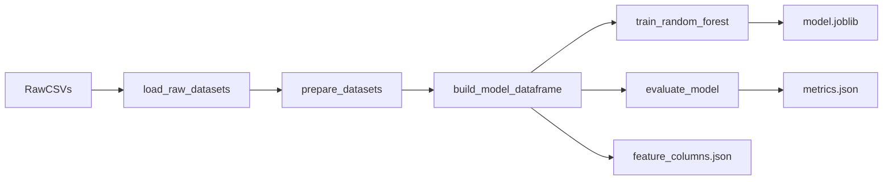

# Food Forecast App

This repository rebuilds the original food insecurity forecasting resume project into a simple, interview-friendly architecture:

- `training/` for offline machine learning work
- `backend/` for FastAPI inference
- `frontend/` for the Next.js browser app

The main goal of this rebuild is not just to make the app work. It is to make the app easy to understand end to end.

## What This App Does

The app predicts monthly food distribution needs based on a small set of inputs:

- month
- population
- SNAP participants
- unemployed people
- people below poverty
- previous month food distributed

The browser form sends those raw values to the backend. The backend converts them into the same feature format used during training, loads the saved model artifact, and returns a prediction.

## Architecture

### `training/`
Offline machine learning layer.

Inputs:
- raw CSV datasets

Outputs:
- cleaned model-ready dataframe
- evaluation metrics
- saved model artifact
- feature metadata

Why it stays separate:
- training should happen offline
- the backend should not retrain on every request

### `backend/`
FastAPI inference layer.

Inputs:
- JSON request from the frontend or curl/Postman
- saved `joblib` model artifact from `training/`

Outputs:
- JSON prediction response
- health check response

Why it stays separate:
- the backend owns the API contract
- the frontend should not know model internals

### `frontend/`
Next.js + TypeScript browser layer.

Inputs:
- user form values
- backend base URL from environment variables

Outputs:
- rendered browser UI
- `fetch` request to the backend

Why it stays separate:
- the frontend should only handle user interaction and rendering
- it should not contain Python ML code or raw training data

## Repository Structure

```text
food-insecurity-forecasting-app/
  backend/
    app/
    requirements.txt
  frontend/
    app/
    .env.local.example
    package.json
  misc/
  training/
    artifacts/
    data/
      raw/
    src/
      food_forecast/
    train_model.py
  README.md
```

## End-To-End Flow

```mermaid
flowchart LR
    user[UserInBrowser] --> form[NextjsForm]
    form --> fetchStep["fetch POST /predict"]
    fetchStep --> api[FastAPIBackend]
    api --> featurePrep[build_feature_payload]
    featurePrep --> modelInput[ModelInputDataFrame]
    modelInput --> modelFile[joblibModelArtifact]
    modelFile --> prediction[model.predict]
    prediction --> json[PredictionResponseJson]
    json --> ui[RenderedPredictionResult]
```



## Training Flow



## Local Setup

### 1. Create and activate a Python virtual environment

```powershell
python -m venv .venv
.\.venv\Scripts\Activate.ps1
```

What this does:
- creates an isolated Python environment for this project
- keeps backend and training packages separate from your global Python install

### 2. Install training dependencies

```powershell
pip install -r training/requirements.txt
```

### 3. Train the model and save artifacts

```powershell
python training/train_model.py
```

Expected outputs:
- `training/artifacts/model.joblib`
- `training/artifacts/metrics.json`
- `training/artifacts/feature_columns.json`

### 4. Install backend dependencies

```powershell
pip install -r backend/requirements.txt
```

### 5. Start the backend

```powershell
uvicorn backend.app.main:app
```

Backend URL:

```text
http://127.0.0.1:8000
```

Health check:

```powershell
Invoke-RestMethod -Uri "http://127.0.0.1:8000/health" | ConvertTo-Json -Depth 4
```

### 6. Install frontend dependencies

```powershell
cd frontend
npm install
Copy-Item .env.local.example .env.local
```

### 7. Start the frontend

```powershell
npm run dev
```

Frontend URL:

```text
http://localhost:3000
```

## Environment Variables

### Frontend

`frontend/.env.local`

```text
NEXT_PUBLIC_API_BASE_URL=http://127.0.0.1:8000
```

Why `NEXT_PUBLIC_` matters:
- browser-side Next.js code can only read env vars that start with `NEXT_PUBLIC_`

### Backend

The backend can optionally read:

```text
MODEL_ARTIFACT_PATH
```

If not provided, it defaults to:

```text
training/artifacts/model.joblib
```

## Key Files

### Training

- `training/src/food_forecast/prepare_dataset.py`
  - cleans the raw datasets and builds the model dataframe
- `training/src/food_forecast/modeling.py`
  - trains and evaluates the Random Forest
- `training/train_model.py`
  - runs the training pipeline and saves artifacts

### Backend

- `backend/app/schemas.py`
  - defines the API request and response shapes
- `backend/app/predictor.py`
  - converts raw request values into model features and calls `model.predict(...)`
- `backend/app/main.py`
  - creates the FastAPI app and exposes `/health` and `/predict`

### Frontend

- `frontend/app/page.tsx`
  - renders the prediction form and sends the `fetch` request
- `frontend/.env.local`
  - stores the backend base URL for local development

## Example Predict Request

```json
{
  "month": 6,
  "population": 100000,
  "snap_participants": 12000,
  "unemployed_people": 4500,
  "people_below_poverty": 15000,
  "previous_month_food_lbs": 70000
}
```

## Example Predict Response

```json
{
  "predicted_food_lbs": 76964.97900675687,
  "features_used": {
    "month": 6.0,
    "snap_per_capita": 0.12,
    "unemp_per_capita": 0.045,
    "poverty_per_capita": 0.15,
    "prev_food": 70000.0
  }
}
```

## Current Limitations

- the model is trained on a very small monthly dataset
- evaluation is currently in-sample
- there is no database
- local setup still uses separate commands for training, backend, and frontend

Those tradeoffs are intentional for this rebuild:
- keep the architecture simple
- make each layer easy to explain
- maximize interview payoff per hour

## Study Notes

The `misc/` folder contains phase-by-phase notes that explain:

- what was built
- why it exists
- exact commands
- testing steps
- git steps
- interview talking points
