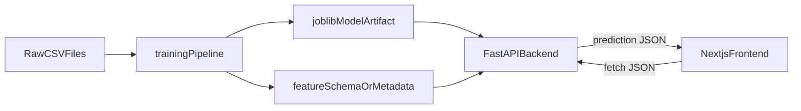

# Food Forecast Rebuild Analysis

## Source File Analyzed

Assumption: the actual file in the repo is `[C:/Users/Robert/dev/git/interview/food-insecurity-forecasting-app/food-insecurity-forecasting-app/ml4va.py](C:/Users/Robert/dev/git/interview/food-insecurity-forecasting-app/food-insecurity-forecasting-app/ml4va.py)`. Your prompt says `ml4uva.py`, but `ml4va.py` is the file currently present.

## High-Level Read Of The Script

This file is a notebook export, not an app module. It mixes several different jobs in one place:

- Colab setup and ad hoc imports
- CSV loading and cleaning
- county/FIPS matching
- exploratory correlation analysis and plotting
- county high-need classification and map plotting
- a small Random Forest regression experiment
- a commented-out neural network forecasting idea
- a Prophet experiment

That means it is useful as source material, but not ready to be used directly as backend or frontend code.

## What Each Part Is Doing

### Data Loading

The script loads these input files from the current working directory:

- `va_food_banks.csv`
- `HDPulse_data_export.csv`
- `Dec_2024_Participation_Report.csv`
- `bls_unemployment_by_month_county.csv`
- `2010_2024_population.csv`

It also depends on:

- Colab mount setup: `drive.mount('/content/drive')`
- Remote geojson URL for mapping: `https://raw.githubusercontent.com/plotly/datasets/master/geojson-counties-fips.json`

### Preprocessing

The script:

- drops null rows from each dataset
- normalizes column names on some tables
- builds `date` columns from year/month inputs
- pads or prefixes FIPS codes
- strips punctuation and leading characters from county names
- converts wide population data into long format

### Feature Engineering

The script creates:

- `unemployment_rate_per_capita`
- `snap_participation_per_capita`
- `food_per_capita`
- `poverty_per_capita`
- `prev_food`
- month-based aggregates like average unemployment, SNAP participation, and food distribution
- heuristic `high_need` and `high_need_score` labels based on 75th percentile thresholds

### Model Training

The actual fitted supervised model in the file is:

- `RandomForestRegressor(n_estimators=100, random_state=42)`

It trains on a 12-row monthly aggregate dataset with features:

- `month`
- `snap_per_capita`
- `unemp_per_capita`
- `poverty_per_capita`
- `prev_food`

Target:

- `food_distributed_pounds`

There is also:

- commented-out neural-network forecasting code that is not runnable as-is
- a separate Prophet time-series experiment at the end

### Evaluation

The script evaluates the Random Forest using:

- in-sample predictions on the same data it was trained on
- `r2_score`
- RMSE via `mean_squared_error(..., squared=False)`

This is useful for a quick experiment but not a strong production evaluation because:

- it trains and predicts on the same 12 rows
- the sample size is tiny
- the score is likely optimistic

### Plotting / Notebook-Style Analysis / One-Off Experiments

These belong to exploration, not the deployed app:

- dataset previews with `display(...)`
- correlation plots with `sns.regplot(...)`
- heatmap of feature correlations
- feature importance bar plot
- actual vs predicted line chart
- county choropleth map
- Prophet forecast visualization
- the commented-out long-horizon forecasting section

## Expected Input Files And Columns

### `va_food_banks.csv`

Columns referenced by the script:

- `Year`
- `Month`
- `FIPS`
- `Locality`
- `Pounds of Food Distributed`

Later normalized/used as:

- `year`
- `month`
- `fips`
- `date`
- `food_distributed_pounds`

Important issue:

- The script renames `pounds_of_food_distributed` to `food_distributed_pounds`, but elsewhere expects `Pounds of Food Distributed`. That means the script is internally inconsistent and the exact raw column name must be confirmed from the real CSV.

### `HDPulse_data_export.csv`

Columns referenced:

- `County`
- `FIPS`
- `People (Below Poverty)`

Later normalized/used as:

- `county`
- `fips`
- `people_below_poverty`

### `Dec_2024_Participation_Report.csv`

Columns referenced:

- `LOCALITY`
- `FIPS`
- `PERSONS\n (TOTAL)`
- `date`

Later normalized/used as:

- `locality`
- `fips`
- `persons_total`
- `date`

### `bls_unemployment_by_month_county.csv`

Columns referenced:

- `StateCode`
- `CountyCode`
- `Year`
- `Period`
- `Unemployment`

Later derived/used as:

- `month`
- `date`
- `fips`

### `2010_2024_population.csv`

Columns referenced:

- `County`
- year columns `2010` through `2024`

Later derived/used as:

- `county_clean`
- `fips`
- long-form `year`
- long-form `population`

## Hardcoded Paths / Runtime Assumptions

- The script assumes all CSVs are available in the current working directory.
- It contains Colab-specific code: `from google.colab import drive` and `drive.mount('/content/drive')`.
- It fetches map geojson from a remote URL.
- It uses notebook-only display behavior via `display(...)`.

## What Is Needed Later For Inference

Only a small slice of this file is needed in a deployed app.

Keep for inference design:

- the final prediction target: `food_distributed_pounds`
- the final chosen feature recipe
- the exact preprocessing needed to turn request data into model input
- the trained model artifact saved with `joblib`
- metadata describing expected input fields and feature order

For the current Random Forest experiment, the backend would need values that can produce these model features:

- `month`
- `snap_per_capita`
- `unemp_per_capita`
- `poverty_per_capita`
- `prev_food`

A beginner-friendly API design would accept raw business inputs instead:

- `month`
- `population`
- `snap_participants`
- `unemployed_people`
- `people_below_poverty`
- `previous_month_food_lbs`

Then the backend computes the per-capita features before calling `model.predict(...)`.

## What Should Stay Training-Only

These should remain in the `training/` layer and not be imported into the backend or frontend:

- CSV ingestion
- heavy data cleaning
- one-time merging logic for historical data
- exploratory plots and notebooks
- correlation studies
- county map generation
- model training code
- model evaluation code
- experimentation with Prophet / neural nets / alternate approaches

## Recommended Clean Architecture

### `training/`

Purpose:

- offline work only
- reads raw CSVs
- cleans and joins data
- trains model
- evaluates model
- saves `joblib` artifact and lightweight metadata

Inputs:

- raw CSV files

Outputs:

- trained model file
- optional metrics file
- optional sample input/output JSON for backend testing

Why separate:

- training is slow and changes with experiments
- the backend should not retrain on every request

### `backend/`

Purpose:

- online inference API only
- loads saved model artifact once at startup
- exposes endpoints like `/health` and `/predict`
- validates request JSON and returns prediction JSON

Inputs:

- HTTP JSON request from frontend or curl/Postman
- model artifact from `training/`
- environment variables such as frontend origin or model path

Outputs:

- JSON responses

Why separate:

- the backend owns prediction logic and API contract
- the frontend should not know how model internals work

### `frontend/`

Purpose:

- user-facing form and results page
- collects input values
- calls backend with `fetch`
- displays prediction and simple explanations

Inputs:

- user form values
- backend base URL via environment variable

Outputs:

- browser UI
- HTTP request to backend

Why separate:

- keeps UI concerns out of Python service code
- mirrors how real production apps are commonly deployed

## Refactor Recommendation Before Building

Start by treating `ml4va.py` as source material to extract from, not as a file to keep “as is.”

Refactor goal:

- keep the real data cleaning and feature logic that matters
- remove notebook-only display/plotting from the training pipeline
- choose one model path for the first rebuild
- freeze a simple backend input contract

Recommended first model path for the rebuild:

- keep one regression model only
- use Random Forest first
- postpone Prophet and neural network experiments

Recommended first-serving contract:

- frontend sends raw numeric inputs
- backend computes per-capita features and runs inference
- no database
- no retraining in backend

## Important Risks To Discuss Before Coding

- The current Random Forest is trained on only 12 monthly aggregate rows, which is too small for a strong production story.
- The current evaluation is in-sample, so the reported score is not trustworthy for interviews unless clearly qualified.
- The food-bank column naming looks inconsistent and must be verified during refactor.
- The script currently blends county-level and statewide/monthly aggregate logic, so we should choose one prediction level for the rebuild and keep it consistent.

## Simplest Interview-Friendly Target App

Use this as the first rebuild target:

- Training pipeline builds one clean tabular dataset.
- Model predicts monthly food distribution in pounds.
- Backend serves `/health` and `/predict`.
- Frontend has a single form and results card.
- Environment variable in frontend points to backend URL.
- Model artifact is generated offline and loaded by backend.

This gives you a clean story for interviews:

- training is offline
- backend is the prediction layer
- frontend is the presentation layer
- the API is the contract between them

## What We Will Do Next After Approval

1. Create the monorepo shape: `training/`, `backend/`, `frontend/`, `README.md`.
2. Move the useful logic from `ml4va.py` into a clean training pipeline.
3. Save a `joblib` model artifact and document the exact feature contract.
4. Build a minimal FastAPI inference service.
5. Build a minimal Next.js frontend that calls the backend with `fetch`.
6. Add local env vars and deployment guidance for separate frontend/backend hosting.

