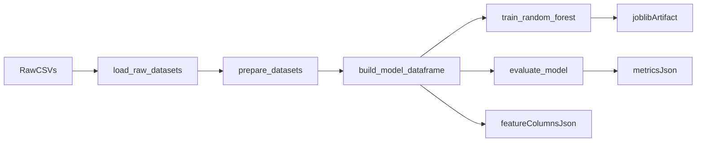

# Phase 3 Study Notes

## What We Built

We added a real training command that turns the cleaned dataset into a saved model artifact:

```text
training/
  artifacts/
    model.joblib
    metrics.json
    feature_columns.json
  train_model.py
```

## Why This Phase Exists

This phase creates the bridge between:
- offline training code
- future backend inference code

Before this phase, we had reusable training modules but no saved output.

After this phase, we have a model file the backend can load later.

## Important File Roles

### `training/train_model.py`
Layer:
- training

Role:
- run the full offline training flow from raw CSVs to saved artifacts

Inputs:
- raw CSVs from `training/data/raw`
- config values from `training/src/food_forecast/config.py`
- reusable training functions from `training/src/food_forecast`

Outputs:
- `training/artifacts/model.joblib`
- `training/artifacts/metrics.json`
- `training/artifacts/feature_columns.json`

Why separate:
- this is a runnable command, not reusable library code

### `training/artifacts/model.joblib`
Layer:
- training output that will later be used by backend

Role:
- store the trained Random Forest model

Inputs:
- fitted scikit-learn model object

Outputs:
- serialized model file on disk

Why separate:
- backend should load a saved model, not retrain on startup

### `training/artifacts/metrics.json`
Role:
- keep a simple record of training results

Inputs:
- evaluation metrics from the training run

Outputs:
- JSON summary of model quality

Why separate:
- metrics should be inspectable without loading Python code

### `training/artifacts/feature_columns.json`
Role:
- freeze the exact feature order used during training

Inputs:
- `MODEL_FEATURES` from config

Outputs:
- JSON list of model feature names

Why separate:
- backend inference must build inputs in the same order as training

## Exact Training Flow



## What The Training Command Does

When you run:

```powershell
python training/train_model.py
```

the script:

1. loads all raw CSVs
2. cleans and prepares the datasets
3. builds the final 12-row monthly modeling dataframe
4. trains the Random Forest
5. evaluates it on the same dataset
6. saves the model and metadata files
7. prints a short summary in the terminal

## Actual Outputs From This Run

- model rows: `12`
- R²: `0.8821`
- RMSE: `2622.92 lbs`

Saved files:
- `training/artifacts/model.joblib`
- `training/artifacts/metrics.json`
- `training/artifacts/feature_columns.json`

## Important Reality Check

This evaluation is still:
- in-sample
- based on only 12 monthly rows

So it is useful for learning and app wiring, but not a strong scientific validation story yet.

That is okay for this rebuild because the main goal is to understand the architecture end to end.

## Commands For This Phase

Activate your virtual environment:

```powershell
.\.venv\Scripts\Activate.ps1
```

Train the model:

```powershell
python training/train_model.py
```

Inspect the saved artifacts:

```powershell
ls training/artifacts
```

Optional: open the JSON files directly:

```powershell
type training/artifacts/metrics.json
type training/artifacts/feature_columns.json
```

## How To Test This Phase

1. Run `python training/train_model.py`
2. Confirm the command finishes without errors
3. Confirm `training/artifacts` contains the three files
4. Confirm `feature_columns.json` contains:
   - `month`
   - `snap_per_capita`
   - `unemp_per_capita`
   - `poverty_per_capita`
   - `prev_food`
5. Confirm `metrics.json` contains `r2`, `rmse`, and `row_count`

## Git Commands For This Phase

Check changes:

```powershell
git status
```

Stage everything for Phase 3:

```powershell
git add training misc
```

Recommended commit:

```powershell
git commit -m "Train model and save inference artifacts"
```

Push decision:
- reasonable to push after this phase
- this is the first point where the backend will have a real model artifact to load later

Push command if you want to push:

```powershell
git push
```

## Commit Boundary Reason

This is a good commit boundary because it captures the full offline training output before we start backend API work.

## Interview Talking Points

- I separated reusable training modules from the runnable training command so the flow is easier to understand and maintain.
- I saved the trained model with `joblib` so the backend can load it later without retraining.
- I also saved metrics and feature-column metadata so the training run is easier to inspect and the backend can stay consistent with training.
- The model artifact is the handoff point between offline training and online inference.
- I explicitly kept training and inference separate because in real applications the API should serve predictions, not retrain the model on each request.
