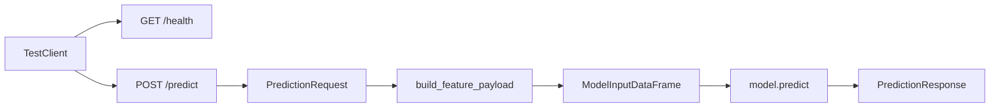

# Phase 5 Study Notes

## What We Built

We did not add a new app layer in this phase.

Instead, we proved that the FastAPI backend actually works at runtime by:
- starting the server locally
- calling `GET /health`
- calling `POST /predict`

## Why This Phase Exists

Building an API file is not the same as proving the API works.

This phase exists so you understand:
- how to run the backend locally
- what an endpoint looks like when called for real
- what JSON goes into `/predict`
- what JSON comes back out

## What Layer We Worked On

This was still the `backend/` layer.

But the focus changed:
- Phase 4 was backend implementation
- Phase 5 was backend runtime testing

## What An API Endpoint Actually Is

In this project:

- `/health` is a URL that runs backend code and returns status JSON
- `/predict` is a URL that accepts JSON input, runs inference, and returns JSON output

That means the frontend does not call Python functions directly.

The frontend will make an HTTP request to a backend URL, and the backend decides what code runs.

## Exact Commands Used

### Start the backend

```powershell
uvicorn backend.app.main:app --reload
```

What this does:
- starts the FastAPI server locally
- serves requests on `http://127.0.0.1:8000`
- reloads the server automatically when backend files change

### Test `GET /health`

```powershell
Invoke-RestMethod -Uri "http://127.0.0.1:8000/health" | ConvertTo-Json -Depth 4
```

Actual response:

```json
{
  "status": "ok",
  "model_loaded": true
}
```

What this tells you:
- the backend process is running
- the model artifact loaded successfully at startup

### Test `POST /predict`

```powershell
$body = @{
  month = 6
  population = 100000
  snap_participants = 12000
  unemployed_people = 4500
  people_below_poverty = 15000
  previous_month_food_lbs = 70000
} | ConvertTo-Json

Invoke-RestMethod -Uri "http://127.0.0.1:8000/predict" -Method Post -ContentType "application/json" -Body $body | ConvertTo-Json -Depth 6
```

Actual response:

```json
{
  "predicted_food_lbs": 76964.97900675687,
  "features_used": {
    "month": 6.0,
    "snap_per_capita": 0.12,
    "unemp_per_capita": 0.045,
    "poverty_per_capita": 0.15,
    "prev_food": 70000.0
  }
}
```

## Why The Response Includes `features_used`

This is useful for learning because it shows the translation from:
- raw API request fields

to:
- the model features used during inference

That makes the training-to-backend connection much easier to understand.

## End-To-End Request Flow



## Local Development Vs Production

Local development:
- you run `uvicorn` on your machine
- you call `http://127.0.0.1:8000`

Production:
- the backend would run on a deployed server
- the frontend would call the deployed backend URL instead of localhost

The shape of the request and response would stay basically the same.

## How To Test This Phase Yourself

1. Activate your virtual environment
2. Install backend dependencies if needed
3. Run `uvicorn backend.app.main:app --reload`
4. In another terminal, call `/health`
5. In another terminal, call `/predict`
6. Confirm the response includes `predicted_food_lbs`

## Git Commands For This Phase

Check changes:

```powershell
git status
```

Stage Phase 5 docs:

```powershell
git add backend/README.md misc/phase-05-local-api-testing.md
```

Suggested commit:

```powershell
git commit -m "Test FastAPI endpoints locally"
```

Push decision:
- yes, this is a good point to push
- the backend now exists and has been tested with real requests

Push command:

```powershell
git push
```

## Commit Boundary Reason

This is a good commit boundary because it captures the difference between “backend code written” and “backend code actually tested.”

## Interview Talking Points

- I tested the backend locally with real HTTP requests instead of assuming the endpoints worked because the code compiled.
- I used a health endpoint to verify startup and model loading separately from inference behavior.
- I designed the predict endpoint to accept simple business inputs and convert them into the exact model features used during training.
- The backend returns JSON, which is the contract the frontend will consume next.
- This phase helped verify the online inference path before adding any frontend code.
