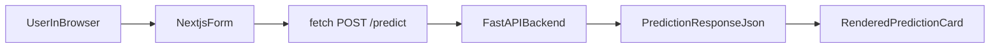

# Phase 6 Study Notes

## What We Built

We created the first version of the Next.js frontend:

```text
frontend/
  app/
    globals.css
    layout.tsx
    page.tsx
  next-env.d.ts
  next.config.ts
  package.json
  tsconfig.json
```

## Why This Phase Exists

This phase creates the browser layer.

The frontend has one main job:
- collect user input
- send it to the backend
- display the prediction

That means the frontend does not know how the model works internally.
It only knows how to send a request to the API and render the response.

## What Layer We Worked On

This phase is entirely in the `frontend/` layer.

## Important File Roles

### `frontend/app/layout.tsx`
Role:
- provide the shared document layout for the app

Inputs:
- page children

Outputs:
- HTML shell for the frontend

Why separate:
- app-wide layout should stay separate from page-level behavior

### `frontend/app/page.tsx`
Role:
- render the form
- store local form state
- send a `fetch` request to the backend
- display the prediction result and feature values

Inputs:
- browser form inputs

Outputs:
- POST request to `/predict`
- rendered prediction result

Why separate:
- this file owns the actual page behavior

### `frontend/app/globals.css`
Role:
- style the app

Inputs:
- none

Outputs:
- visual styling

Why separate:
- CSS should stay outside React logic

## What The Frontend Request Does

When the user clicks **Get prediction**, the page sends this JSON shape to the backend:

```json
{
  "month": 6,
  "population": 100000,
  "snap_participants": 12000,
  "unemployed_people": 4500,
  "people_below_poverty": 15000,
  "previous_month_food_lbs": 70000
}
```

That request goes to:

```text
http://127.0.0.1:8000/predict
```

For Phase 6, that URL is hardcoded in the page component so the request flow is easy to see.

We will move it into an environment variable in Phase 7.

## Frontend To Backend Flow



## Local Commands

Install frontend dependencies:

```powershell
cd frontend
npm install
```

Run the frontend:

```powershell
npm run dev
```

Open the app:

```text
http://localhost:3000
```

## Validation Performed

### Build validation

The frontend passed:

```powershell
npm run build
```

### Browser validation

With the backend running locally, the form was tested in the browser with the default values.

Observed result:
- prediction displayed successfully
- features-used section displayed successfully

Displayed prediction:
- `76,964.98 lbs`

Displayed features:
- `month`: 6
- `snap_per_capita`: 0.12
- `unemp_per_capita`: 0.045
- `poverty_per_capita`: 0.15
- `prev_food`: 70000

## Important Real-World Bug We Hit

At first, the browser could not call the backend because of a CORS error.

Why that happened:
- the frontend runs on `http://localhost:3000`
- the backend runs on `http://127.0.0.1:8000`
- the browser treats those as different origins

Fix:
- we added FastAPI CORS middleware in the backend
- we restarted the backend process so the new middleware was active

This is a very normal full-stack issue and a useful interview talking point.

## How To Test This Phase Yourself

1. Start the backend:

```powershell
uvicorn backend.app.main:app
```

2. Start the frontend:

```powershell
cd frontend
npm run dev
```

3. Open `http://localhost:3000`
4. Submit the default form values
5. Confirm a prediction result appears
6. Confirm the features-used section appears

## Git Commands For This Phase

Check changes:

```powershell
git status
```

Stage Phase 6 files:

```powershell
git add frontend backend/app/main.py misc/phase-06-nextjs-frontend.md
```

Suggested commit:

```powershell
git commit -m "Build Next.js prediction form"
```

Push decision:
- reasonable to wait until after Phase 7
- Phase 7 will clean up the backend URL with environment variables

If you still want to push now:

```powershell
git push
```

## Commit Boundary Reason

This is a good commit boundary because it captures the first working browser-to-backend flow before environment variable cleanup.

## Interview Talking Points

- I built a minimal Next.js frontend that sends a prediction request to the FastAPI backend with `fetch`.
- I kept the frontend thin so it only handles user interaction and rendering, not model logic.
- The backend returns both the prediction and the feature values used, which makes the flow easier to debug and explain.
- I hit and fixed a real CORS issue, which is a common problem when connecting a local frontend and backend running on different origins.
- This phase proved the full browser-to-API inference path before introducing environment-variable configuration.
