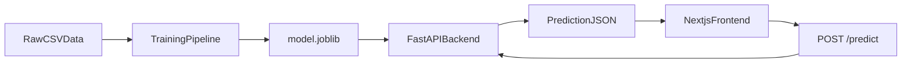

# Phase 11 Study Notes

## Final Interview Walkthrough

## 30-Second Version

I rebuilt a food insecurity forecasting project using a simple production-shaped architecture.

I separated the project into:
- a `training/` layer that reads raw CSVs, prepares the data, trains a Random Forest model, and saves a `joblib` artifact
- a `backend/` layer built with FastAPI that loads the saved model and exposes `/health` and `/predict`
- a `frontend/` layer built with Next.js and TypeScript that collects user inputs, calls the backend with `fetch`, and displays the prediction

I also deployed the backend and frontend separately, which made the app easier to reason about and closer to how real systems are often structured.

## 2-Minute Version

This project predicts monthly food distribution needs using a small set of socioeconomic inputs.

The architecture has three clear layers:

### `training/`
This is the offline ML layer.
It reads the raw SNAP, poverty, unemployment, population, and food-distribution CSVs, cleans them, engineers the model features, trains a Random Forest model, evaluates it, and saves:
- `model.joblib`
- `metrics.json`
- `feature_columns.json`

That saved model artifact is the handoff point to the backend.

### `backend/`
This is a FastAPI inference service.
It loads the saved model at startup, exposes:
- `GET /health`
- `POST /predict`

The backend accepts raw business-style inputs like month, population, and SNAP participants, converts those into the exact feature format used during training, then runs `model.predict(...)` and returns JSON.

### `frontend/`
This is a Next.js + TypeScript app.
It renders a simple prediction form, reads the backend base URL from an environment variable, sends a `fetch` request to `/predict`, and displays the prediction and the features used.

I deployed the backend on Render and prepared the frontend for Vercel deployment. One useful real-world issue I hit was CORS, which I fixed by making allowed origins configurable in the backend.

## Simple Architecture Explanation



## How I Would Explain The Request Flow

When a user submits the form:

1. the frontend collects the input values in the browser
2. it sends those values as JSON to the backend `/predict` endpoint
3. the backend validates the request body with Pydantic schemas
4. the backend converts the raw values into the same feature format used during training
5. the backend loads the saved model artifact and runs inference
6. the backend returns the prediction as JSON
7. the frontend renders the prediction result in the UI

## How I Would Explain What An API Endpoint Is

In this project, an API endpoint is a URL exposed by the backend that runs server-side code.

For example:
- `/health` tells me whether the service is up
- `/predict` accepts JSON input and returns JSON output

The frontend does not call Python functions directly.
It sends an HTTP request to a backend URL, and the backend decides what code runs.

## How I Would Explain Inference

Inference means using a trained model to make a prediction on new input data.

In this app:
- training happens offline in `training/`
- inference happens online in `backend/`

The backend is not retraining the model.
It is only loading the already-trained `joblib` artifact and running `model.predict(...)`.

## Key Tradeoffs I Made

### No database
Why:
- faster to build
- easier to explain
- enough for a prediction demo

Tradeoff:
- no persistence for user requests or prediction history

### Separate training and backend
Why:
- cleaner architecture
- easier to explain
- backend stays lightweight

Tradeoff:
- you need to train and save the artifact before serving predictions

### Random Forest instead of more advanced serving setup
Why:
- fast to implement
- easier to reason about
- strong enough for the learning goal

Tradeoff:
- not necessarily the most sophisticated modeling approach

### Simple UI
Why:
- keeps focus on architecture and request flow

Tradeoff:
- not optimized for product polish

## Limitations I Would Say Out Loud

- the training dataset for the final model is small
- evaluation is currently in-sample
- there is no database
- the app is optimized for architecture clarity rather than full production maturity

This is actually a strong answer if you say it confidently, because it shows you understand the difference between a learning-focused rebuild and a production-scale system.

## Strong Interview Answers

### “Why did you split it into training, backend, and frontend?”
Because those layers have different responsibilities.

- training handles offline ML work
- backend handles online inference and API contracts
- frontend handles browser interaction

That separation made the app easier to reason about, easier to deploy, and easier to explain.

### “Why save the model with joblib?”
Because the backend needs a fast, simple way to load a pre-trained model at startup without retraining.

### “Why use environment variables?”
Because the same code should work in local development and production without editing the source.

### “What was the hardest integration issue?”
CORS between the deployed frontend and backend was a good real-world issue.
The backend and frontend were on different origins, so I had to configure allowed origins in FastAPI.

### “If you had more time, what would you improve?”
- add better evaluation methodology
- add tests for backend inference routes
- improve UI polish
- possibly add logging or request analytics
- maybe store prediction history if there were a real product need

## Resume-Friendly Talking Points

- Rebuilt a machine learning forecasting app with clear separation between offline training, backend inference, and browser frontend layers
- Served model predictions through a FastAPI API using a saved `joblib` artifact
- Built a Next.js frontend that submits prediction requests and displays inference results
- Configured environment variables and CORS for local and deployed frontend/backend communication
- Deployed backend and frontend separately using platform-appropriate hosting

## How To Practice This

Practice answering these in order:

1. What does the app do?
2. What are the three layers?
3. What happens when the user submits the form?
4. Where does inference happen?
5. Why did you use environment variables?
6. What tradeoffs did you make?

If you can answer those clearly, you understand the project.

## Git Commands For This Phase

Check changes:

```powershell
git status
```

Stage Phase 11 file:

```powershell
git add misc/phase-11-interview-walkthrough.md
```

Suggested commit:

```powershell
git commit -m "Add interview walkthrough and architecture summary"
```

Push decision:
- yes, this is a clean final push point

Push command:

```powershell
git push
```

## Commit Boundary Reason

This is a good final commit boundary because it captures interview documentation separately from implementation and deployment work.
